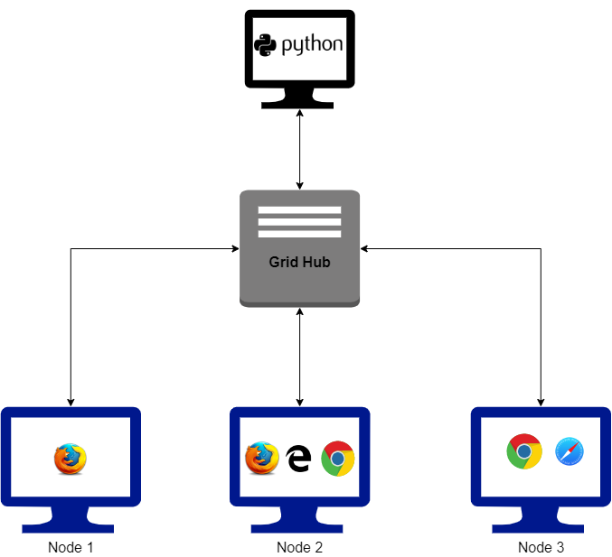
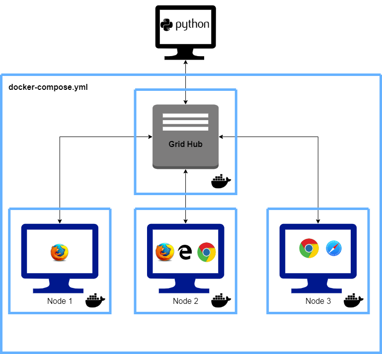

# Selenium Grid Brown Bag Session
Base Selenium Behave with simple Page verifications

# Tasks
1. Setup Remote WebDrivers
2. Set WebDriver Capabilities
3. Setup Grid Hub
4. Setup Grid Nodes and Register them to the Hub 
5. Run it on Docker Compose

# Grid Node and Hub

# Dockerized Grid Node and Hub
